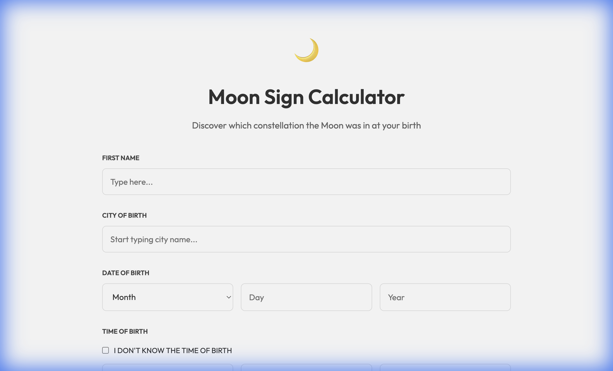
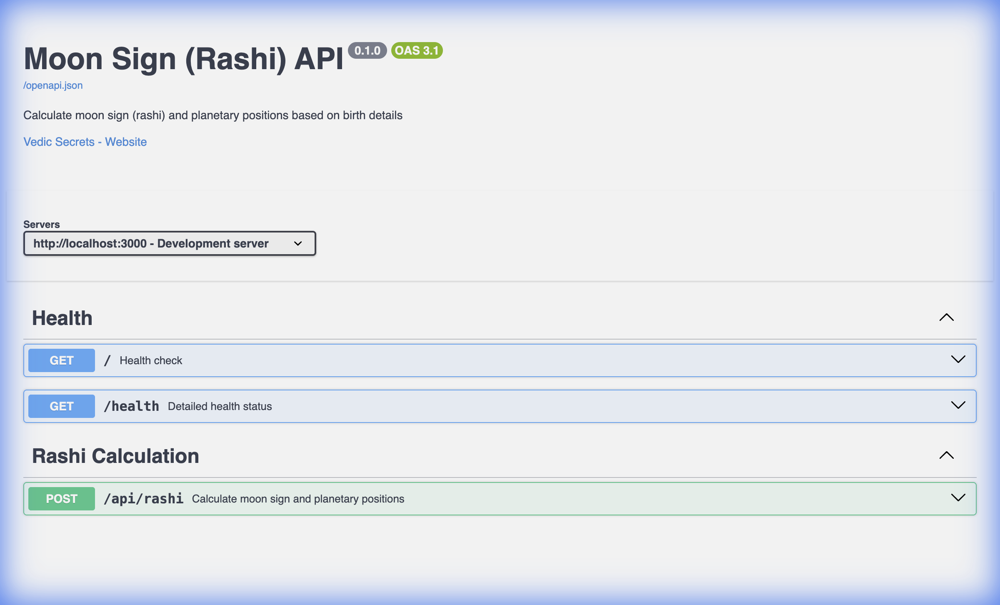

# Moon Sign (Rashi) Calculator

A high-performance Vedic Astrology API and interactive calculator built with Hono and TypeScript.

## 🌟 Features

- **Moon Sign (Rashi) Calculation**: Get precise moon sign and planetary positions.
- **Interactive Test Page**: A premium, mobile-responsive UI for users to calculate their signs.
- **City Autocomplete**: Built-in geocoding with city search suggestions.
- **Smart Time Handling**: Supports precise birth time or defaults for unknown times.
- **Standardized API**: OpenAPI 3.1.0 specification with built-in Swagger UI.
- **Fast Dev Environment**: Optimized with `tsx watch` for high-speed development.

## 📸 Screenshots

### Interactive Calculator


### API Documentation (Swagger)


## 🛠️ Local Development

1. **Install Dependencies**:
   ```bash
   npm install
   ```

2. **Run Development Server**:
   ```bash
   npm run dev
   ```
   Access the UI at `http://localhost:3000` and Swagger at `http://localhost:3000/docs`.

3. **Build**:
   ```bash
   npm run build
   ```

## 🚀 Deployment

This project is production-ready and can be deployed to platforms like **Railway**, **DigitalOcean App Platform**, or any Docker-compatible environment.

### Using Docker (Recommended)

1. **Build Image**:
   ```bash
   docker build -t moonsign-app .
   ```

2. **Run Container**:
   ```bash
   docker run -p 3000:3000 moonsign-app
   ```

### Railway / DigitalOcean
- Connect your GitHub repository.
- The `Dockerfile` will be automatically detected.
- Set the `PORT` environment variable to `3000` (or leave as default).

## 🧮 API Endpoints

- `GET /health`: Server and dependency health check.
- `POST /api/geocode`: Search for locations or get precise coordinates.
- `POST /api/rashi`: Calculate planetary positions based on birth details.

## 📝 License

MIT
