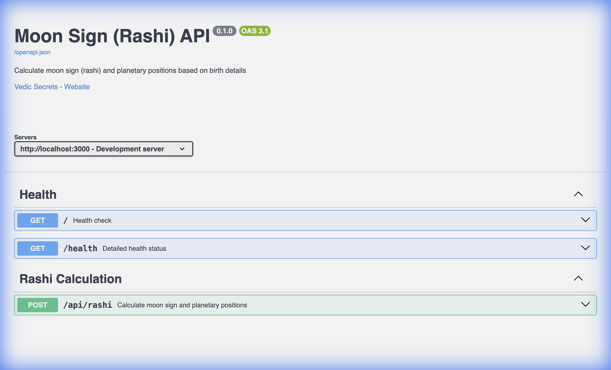

# Moon Sign (Rashi) Calculator

A high-performance Vedic Astrology API and interactive calculator built with Hono and TypeScript.

## 🌟 Features

- **Moon Sign (Rashi) Calculation**: Get precise moon sign and planetary positions.
- **Interactive Test Page**: A premium, mobile-responsive UI for users to calculate their signs.
- **City Autocomplete**: Built-in geocoding with city search suggestions.
- **Smart Time Handling**: Supports precise birth time or defaults for unknown times.
- **Standardized API**: OpenAPI 3.1.0 specification with built-in Swagger UI.
- **Fast Dev Environment**: Optimized with `tsx watch` for high-speed development.

## 📸 Screenshots

### Interactive Calculator


### API Documentation (Swagger)


## 🛠️ Local Development

1. **Install Dependencies**:
   ```bash
   npm install
   ```

2. **Run Development Server**:
   ```bash
   npm run dev
   ```
   Access the UI at `http://localhost:7860` and Swagger at `http://localhost:7860/docs`.

3. **Build**:
   ```bash
   npm run build
   ```

## 🚀 Deployment

### Hugging Face Spaces (Recommended)

This app is deployed as a **Docker Space** on Hugging Face at port `7860`.

Push to `main` on GitHub — the GitHub Actions workflow will automatically sync to Hugging Face.

Live URL format:
- `https://<space-name>.hf.space/`
- `https://<space-name>.hf.space/api/rashi`
- `https://<space-name>.hf.space/docs`

### Using Docker Locally

1. **Build Image**:
   ```bash
   docker build -t moonsign-app .
   ```

2. **Run Container**:
   ```bash
   docker run -p 7860:7860 moonsign-app
   ```

## 🧮 API Endpoints

- `GET  /health` — Server and dependency health check.
- `HEAD /health` — Lightweight ping for uptime monitors (no response body).
- `POST /api/geocode` — Search for locations or get precise coordinates.
- `POST /api/rashi` — Calculate planetary positions based on birth details.
- `GET  /docs` — Swagger UI.
- `GET  /openapi.json` — Raw OpenAPI 3.1.0 spec.

## 📝 License

MIT
